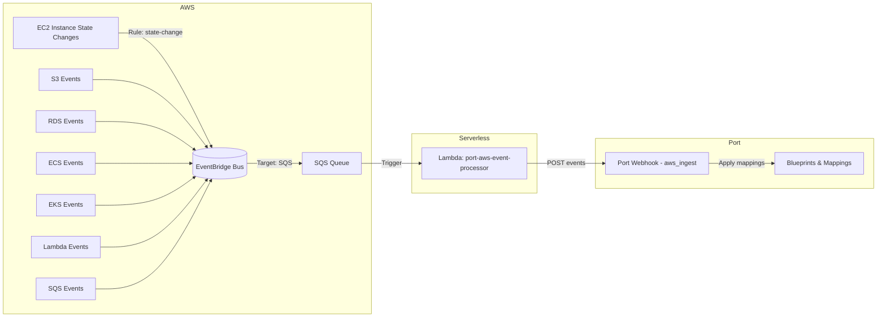

# AWS-Serverless

Event-driven integration that routes AWS events into Port using serverless primitives.

This includes a set of scripts to do the initial setup in Port and CloudFormation templates to set up services within AWS.

## High-level responsibilities

### Within Port
- Create blueprints required for AWS resource types
- Create or update the integration configuration with mapping rules
- Create an ingest webhook that receives routed events
- Apply mapping rules on the webhook so each incoming event is translated into the correct blueprint/entity

### Within AWS
- Deploy SQS queue for reliable event buffering
- Create EventBridge rule that captures AWS events and forwards them to SQS
- Deploy Lambda function that reads from SQS and forwards enriched events to the Port webhook

## Architecture

The pipeline is: **EventBridge → SQS → Lambda → Port (ingest webhook)**. The per-type routing inside Port is handled by mapping rules on the webhook.



## Installation

### Prerequisites

#### Port Requirements
- Port API credentials (Client ID and Client Secret)
- Permissions to create blueprints, integrations, and webhooks in your Port organization

#### AWS Requirements
- AWS account with appropriate permissions (see [Required AWS Permissions](#required-aws-permissions))
- AWS CLI configured with credentials or IAM role
- Python 3.9+ with dependencies from `requirements.txt`

Install Python dependencies:
```bash
pip install -r requirements.txt
# Or using a specific Python/venv:
/path/to/python -m pip install -r requirements.txt
```

### Required AWS Permissions

The installation requires permissions to create and manage the following AWS resources:

- **CloudFormation**: Create and update stacks
- **SQS**: Create queues and queue policies
- **EventBridge**: Create rules and targets
- **Lambda**: Create functions and event source mappings
- **IAM**: Create roles and policies for Lambda execution

Example IAM policy for installation:
```json
{
  "Version": "2012-10-17",
  "Statement": [
    {
      "Effect": "Allow",
      "Action": [
        "cloudformation:CreateStack",
        "cloudformation:UpdateStack",
        "cloudformation:DescribeStacks",
        "cloudformation:DescribeStackEvents",
        "sqs:CreateQueue",
        "sqs:SetQueueAttributes",
        "sqs:GetQueueAttributes",
        "sqs:GetQueueUrl",
        "events:PutRule",
        "events:PutTargets",
        "events:DescribeRule",
        "lambda:CreateFunction",
        "lambda:UpdateFunctionCode",
        "lambda:UpdateFunctionConfiguration",
        "lambda:GetFunction",
        "lambda:CreateEventSourceMapping",
        "lambda:UpdateEventSourceMapping",
        "iam:CreateRole",
        "iam:AttachRolePolicy",
        "iam:PutRolePolicy",
        "iam:GetRole",
        "iam:PassRole"
      ],
      "Resource": "*"
    }
  ]
}
```

### Installation Methods

#### Method 1: Standalone Installation (Single Account)

Use this method to deploy the integration in a single AWS account.

1. **Set required environment variables:**
   ```bash
   export PORT_CLIENT_ID="your-port-client-id"
   export PORT_CLIENT_SECRET="your-port-client-secret"
   ```

2. **Run the installation script:**
   ```bash
   cd integrations/aws-serverless
   python3 install_standalone.py [options]
   ```

   Common usage patterns:
   ```bash
   # Full installation with defaults
   python3 install_standalone.py

   # Custom region and integration ID
   python3 install_standalone.py --aws-region eu-west-1 --integration-id my-aws-integration

   # Setup Port resources only, print CloudFormation command
   python3 install_standalone.py --port-only

   # Dry run to see what would happen
   python3 install_standalone.py --dry-run

   # Custom event sources to monitor
   python3 install_standalone.py --event-sources "aws.ec2,aws.s3,aws.lambda"
   ```The script will:
- Create blueprints in Port (awsAccount, s3Bucket, ec2Instance, ecsCluster, etc.)
- Create or update the integration configuration with mappings from aws-v3
- Create a Port ingest webhook
- Deploy a CloudFormation stack with EventBridge, SQS, and Lambda

3. **Verify installation:**
   - Check the CloudFormation console for the stack status (default: `port-aws-serverless`)
   - Verify the Lambda function is created (default: `port-aws-event-processor`)
   - Check Port for the created blueprints and integration

#### Method 2: AWS StackSets (Multi-Account)

Use StackSets to deploy across multiple AWS accounts in an organization.

> **Note**: StackSets installation documentation is under development. For multi-account deployments, you can currently:
> 1. Run the standalone installation script in each account, or
> 2. Use AWS StackSets manually with the provided CloudFormation template

**Manual StackSets Deployment:**

1. **Set up Port resources once** (run from any location):
  ```bash
  export PORT_CLIENT_ID="your-port-client-id"
  export PORT_CLIENT_SECRET="your-port-client-secret"
  python3 install_standalone.py --port-only
  ```

2. **Create a StackSet** in the AWS Organizations management account using the CloudFormation template at `cloudformation/aws-serverless.template`

3. **Deploy stack instances** to target accounts and regions with parameters:
  - `PortWebhookUrl`: The webhook URL from Port (shown in the install_standalone output or Port UI)
   - `QueueName`: SQS queue name (default: port-aws-events-queue)
   - `LambdaFunctionName`: Lambda function name (default: port-aws-event-processor)

### CLI Options

The installer requires `PORT_CLIENT_ID` and `PORT_CLIENT_SECRET` as environment variables. All other configuration is provided via CLI arguments.

| Option | Default | Description |
|--------|---------|-------------|
| `--port-base-url` | `https://api.getport.io` | Port API base URL |
| `--aws-region` | `us-east-1` | AWS region for deployment |
| `--integration-id` | `aws-serverless` | Integration identifier in Port |
| `--stack-name` | `port-aws-serverless` | CloudFormation stack name |
| `--queue-name` | `port-aws-events-queue` | SQS queue name |
| `--lambda-function-name` | `port-aws-event-processor` | Lambda function name |
| `--webhook` | `aws_ingest` | Webhook identifier, full URL, or partial URL |
| `--event-sources` | `aws.ec2,aws.s3,aws.rds,aws.sqs,aws.ecs,aws.eks,aws.lambda` | Comma-separated AWS event sources to monitor |
| `--port-only` | `false` | Only setup Port resources, print CloudFormation CLI command |
| `--dry-run` | `false` | Simulate actions without making changes |

**Webhook Options:**

The `--webhook` flag accepts three formats:
- **Identifier**: `aws_ingest` (creates/uses webhook with this ID)
- **Full URL**: `https://ingest.getport.io/your-webhook-url` (uses URL directly)
- **Partial URL**: `/v1/webhooks/aws_ingest` (extracts identifier from path)

**Event Sources:**

Use `--event-sources` to customize which AWS services trigger events. The default monitors EC2, S3, RDS, SQS, ECS, EKS, and Lambda. To monitor only EC2 and S3:
```bash
python3 install_standalone.py --event-sources "aws.ec2,aws.s3"
```

**Advanced Workflows:**

```bash
# Setup Port, get CloudFormation command to run manually later
python3 install_standalone.py --port-only

# Preview all actions without executing
python3 install_standalone.py --dry-run

# Custom webhook URL with specific event sources
python3 install_standalone.py \
  --webhook https://ingest.getport.io/custom-webhook \
  --event-sources "aws.ec2,aws.lambda"
```

## Supported AWS Event Types

This integration ships its own blueprints and mappings under `.port/resources`. The following AWS resource types are currently supported:

- **AWS Account** (`AWS::Account::Info`)
- **S3 Buckets** (`AWS::S3::Bucket`)
- **EC2 Instances** (`AWS::EC2::Instance`)
- **ECS Clusters** (`AWS::ECS::Cluster`)
- **RDS Instances** (via EventBridge events)
- **Lambda Functions** (via EventBridge events)
- **SQS Queues** (via EventBridge events)

The EventBridge rule captures events from these sources: `aws.ec2`, `aws.s3`, `aws.rds`, `aws.sqs`, `aws.ecs`, `aws.eks`, `aws.lambda`

Blueprints and mappings are located at:
- Blueprints: `integrations/aws-serverless/.port/resources/blueprints.json`
- Mappings: `integrations/aws-serverless/.port/resources/port-app-config.yml`

## Troubleshooting

### Checking Lambda Logs

View Lambda execution logs in CloudWatch:
```bash
aws logs tail /aws/lambda/port-aws-event-processor --follow
```

### Verifying Event Flow

1. **Check EventBridge metrics**: Verify events are being captured
2. **Check SQS queue**: Look for messages in the queue
3. **Check Lambda invocations**: Verify the Lambda is being triggered
4. **Check Port webhook**: Verify events are arriving in Port

### Common Issues

**Lambda not triggering:**
- Verify the EventSourceMapping is enabled in the CloudFormation stack
- Check the SQS queue has messages
- Review Lambda execution role permissions

**Events not appearing in Port:**
- Verify the webhook URL is correctly configured in Lambda environment variables
- Check Lambda logs for HTTP errors
- Verify Port integration is active

**CloudFormation deployment fails:**
- Check IAM permissions for the deploying user/role
- Review CloudFormation stack events for specific error messages
- Ensure resource names don't conflict with existing resources

## Uninstallation

To remove the integration:

1. **Delete the CloudFormation stack:**
   ```bash
   aws cloudformation delete-stack --stack-name port-aws-serverless
   ```

2. **Remove Port resources** (optional):
   - Delete the integration from Port UI
   - Delete blueprints if no longer needed (be careful not to delete blueprints used by other integrations)

## Development

### Lambda Code Management

This integration uses inline Lambda code defined in the CloudFormation template for simplicity. For larger functions or frequent updates, switch the template to use `Code.S3Bucket` and `Code.S3Key` instead of `ZipFile` and manage your deployment package via S3.

Example: update Lambda code directly with a local zip (outside CloudFormation):

```bash
aws lambda update-function-code \
  --function-name port-aws-event-processor \
  --zip-file fileb://path/to/function.zip
```

To adopt S3-based packaging, upload `function.zip` to S3 and modify the template:

```yaml
Code:
  S3Bucket: your-bucket
  S3Key: path/to/function.zip
```

## Data Flow Details

### Event Processing Pipeline

1. **AWS Service** generates an event (e.g., EC2 state change)
2. **EventBridge** captures the event based on the rule pattern
3. **SQS Queue** buffers the event for reliable processing
4. **Lambda** is triggered by new messages in SQS
5. **Lambda** transforms the event into a Port entity structure (if needed)
6. **Lambda** POSTs the entity to the Port webhook
7. **Port** applies mapping rules and creates/updates entities in blueprints

### Entity Mapping

The Lambda can handle two types of payloads:

1. **Pre-formatted entities**: If the SQS message already contains a Port entity structure (`blueprint` and `identifier` fields), it's forwarded as-is
2. **Raw AWS events**: Raw EventBridge events are wrapped in a minimal entity structure with basic metadata extracted from the event

Mapping rules in Port (from `port-app-config.yml`) handle the transformation of these events into properly typed entities based on the AWS resource kind.

## Contributing

See [CONTRIBUTING.md](../../CONTRIBUTING.md) for guidelines on contributing to this integration.

## Support

For issues, questions, or contributions:
- Open an issue in the repository
- Refer to [Port documentation](https://docs.getport.io)
- Contact Port support through your organization's support channel
