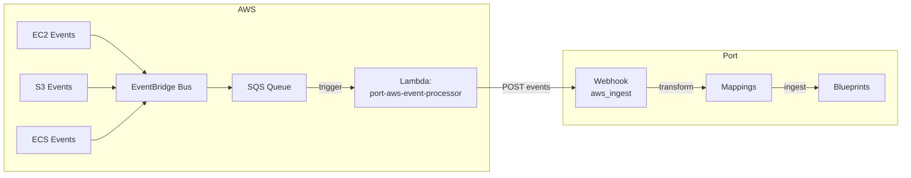

# AWS-Serverless

Event-driven integration that routes AWS events into Port using serverless primitives.

## Why use this?

This integration helps you:
- **Maintain an up-to-date inventory** of your AWS resources
- **Track infrastructure changes** as they happen through EventBridge
- **Eliminate polling** - events are pushed in near real-time, reducing API costs and latency
- **Scale effortlessly** - serverless architecture handles any event volume

## What it does
- In Port: creates required blueprints, applies mapping config, and creates/uses the ingest webhook
- In AWS: deploys EventBridge rule(s), an SQS queue, and a Lambda that forwards events to Port

## Quick Start
**5-minute setup**

From an environment that has permission to create a CloudFormation stack for the AWS account you will be using:
```bash
# Clone the repository and navigate to the integration
git clone --depth 1 https://github.com/port-labs/port-ocean.git
cd port-ocean/integrations/aws-serverless

# Install Python dependencies
pip install -r requirements.txt

# Set Port credentials and run installer
export PORT_CLIENT_ID="your-id"
export PORT_CLIENT_SECRET="your-secret"
python3 install_standalone.py
```

## Architecture

The pipeline is: **EventBridge → SQS → Lambda → Port (ingest webhook)**. The per-type routing inside Port is handled by mapping rules on the webhook.



## Install
See the concise install guide in [`docs/installation.md`](docs/installation.md).

## Supported AWS Event Types

The following AWS resource types are currently supported:

- **AWS Account** (`AWS::Account::Info`)
- **S3 Buckets** (`AWS::S3::Bucket`)
- **EC2 Instances** (`AWS::EC2::Instance`)
- **ECS Clusters** (`AWS::ECS::Cluster`)

Blueprints and mappings live in `.port/resources/` inside this integration.

## Troubleshooting
See [`docs/troubleshooting.md`](docs/troubleshooting.md).

## Uninstall
Delete the CloudFormation stack (`port-aws-serverless` by default); optionally remove the Port integration and blueprints.

## Data flow
See [`docs/dataflow.md`](docs/dataflow.md).

## Limitations & Roadmap

### Immediate TODO
- [ ] Automated StackSets deployment script for multi-account environments
- [ ] Initial sync of entities
- [ ] Handle deletion of entities

### Next steps
- [ ] Dead-letter queue (DLQ) configuration for failed Lambda invocations
- [ ] Support for additional AWS resource types (EKS, DynamoDB, etc.)
- [ ] Integration tests that validate end-to-end event flow
- [ ] Finer grained filtering of events
- [ ] Explor bypassing lambda for certain events

## Contributing

See [CONTRIBUTING.md](../../CONTRIBUTING.md) for guidelines on contributing to this integration.

## Support

For issues, questions, or contributions:
- Open an issue in the repository
- Refer to [Port documentation](https://docs.getport.io)
- Contact Port support through your organization's support channel
